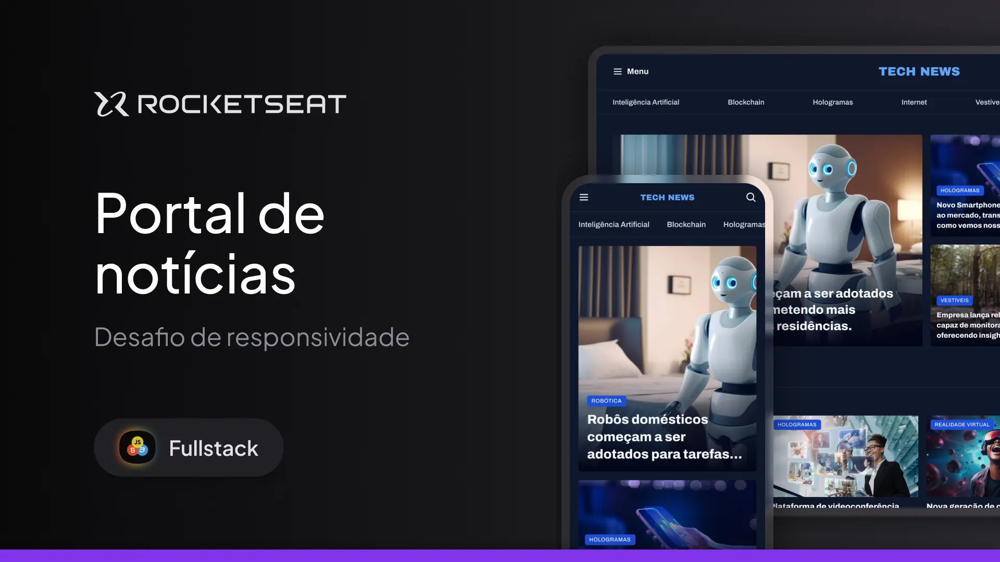

# 🌎 Desafio 04 Rocketseat — Formulário de convite

Projeto desenvolvido como parte do **Desafio 04** do curso **Full Stack**, com o objetivo de construir uma página responsiva Mobile First.

## 🖥️ Tecnologias utilizadas

- **HTML**
- **CSS**

## 🧠 Aprendizados

Durante o desenvolvimento, foram aplicados conceitos de:

- Responsividade;
- Media Queries;
- Mobile First;

## 📸 Prévia do projeto

> **

## 🚀 Como visualizar

1. Faça o clone do repositório:
   ```bash
   git clone https://github.com/WillFriedl/portal-de-noticias-mobile-first
